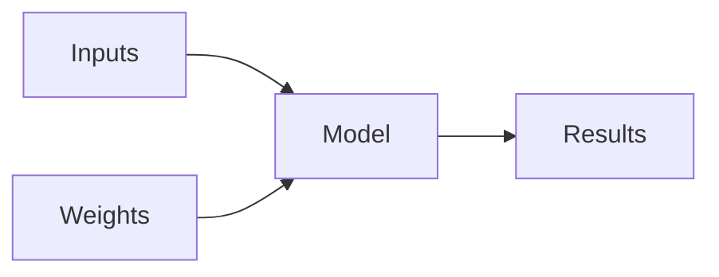

# Lecture 1 - Questions/Answers - Introduction

What was the name of the first device that was based on the principle of the artificial neuron?
> The Mark 1 Perceptron

Based on the book of the same name, what are the requirements for parallel distributed processing (PDP)?
> 1. A set of processing units
> 2. A state of activation
> 3. An output function for each unit
> 4. A pattern of connectivity among units
> 5. A propagation rule for propagating patterns of activities through the network of connectivities
> 6. An activation rule for combining the inputs impinging on a unit with the current state of that unit to produce an output for the unit
> 7. A learning rule whereby patterns of connectivity are modified by experience
> 8. An environment within which the system must operate

What were the two theoretical misunderstandings that held back the field of neural networks?
> The perceived inability of neural networks to solve certain problems (due to the focus on single-layer perceptrons). The overemphasis on two-layer networks despite the practical advantages of deeper architectures.

Why is it hard to use a traditional computer program to recognise images in a photo?
> Traditional programs lack the flexibility, adaptability, and learning capabilities needed to handle the complexity and variability of image data. This is where machine learning, particularly deep learning with neural networks, excels.  Instead of relying on rigid rules, these models learn from data, allowing them to recognize patterns and features in a more robust and generalizable way

What did Samuel mean by "weight assignment"?
> "Weight assignment" refers to setting the values of variables ("weights") that control how a program operates, like tuning the knobs of a machine to change its behavior.

What term do we normally use in deep learning for what Samuel called "weights"?
>Parameters

Draw a picture that summarises Samuel's view of a machine learning model.

Why is it hard to understand why a deep learning model makes a particular prediction?
> Because it is difficult (but not impossible) to audit its decision making process, its attribution of weights, after the model has been trained

What is the name of the theorem that shows that a neural network can solve any mathematical problem to any level of accuracy?
> The Universal Approximation Theorem shows that a neural network can approximate any continuous function, highlighting their flexibility.

What do you need in order to train a model?
> - **Data:** A dataset containing examples and labels (for supervised learning). 
> - **Compute:** Processing power (CPUs, GPUs) to perform the calculations.
> - **Algorithm:** A specific machine learning algorithm (e.g., neural network, decision tree).
> - **Loss Function:** A way to measure the model's error.
> - **Optimizer:** A method to adjust the model's parameters to minimize the loss

How could a feedback loop impact the rollout of a predictive policing model?
> Predicts there is crime in a certain area, which devotes more policing resources to that area, which leads to more arrests in the area, which reports more crime back to the model and the cycle continues

Do we always have to use 224×224-pixel images with the cat recognition model?
> 224×224 became a standard size because early successful models like VGG16 used it. Modern architectures will handle images of any size

What is the difference between classification and regression?
> Classification predicts a category (like "spam" or "not spam"), while regression predicts a continuous value (like a house price)

What is a validation set? What is a test set? Why do we need them?
> Training set: teaches the model to identify cats in images. Validation set: guides training by checking if the model can recognize cats in new images. Test set: grades the final model by evaluating its accuracy on a completely separate set of cat images.

What will fastai do if you don't provide a validation set?
> It will automatically set aside some percentage of the training dataset to be used for validation (20% to be precise)

Can we always use a random sample for a validation set? Why or why not?
> No, for time series data picking random samples would tell a fragmented and incomplete story--The order of that data is important.

What is overfitting? Provide an example.
> Overfitting is when a model memorizes the training data instead of learning general rules, like a student who memorizes answers instead of understanding the material.

What is a metric? How does it differ from "loss"?
> Loss guides the model's training, while a metric evaluates its final performance. Think of loss as your lap times during practice and a metric as your final race time.

How can pretrained models help?
> In essence, pretrained models provide a head start. They offer a foundation of knowledge that you can build upon for your specific task, saving time, resources, and effort.

What is the "head" of a model?
> The "head" is the final part of a model that makes predictions, like the head of a human. The "body" is the earlier part that extracts features from the input data.

What kinds of features do the early layers of a CNN find? How about the later layers?
> Early layers of a CNN find simple features like edges and corners, building up to objects and scenes in later layers by combining those details at bigger and bigger scales.

Are image models only useful for photos?
> No, they can be used for any data that can be represented as a grid of numbers, including scientific visualizations, medical scans, satellite imagery, and more.

What is an 'architecture'?
> The specific structure and arrangement of layers and connections in a neural network that determines how data flows through the model.

What is segmentation?
> The task of dividing an image into different segments by assigning each pixel to a specific class or object category.

What is y_range used for? When do we need it?
> y_range specifies the minimum and maximum values for the target variable. It's needed when creating regression models to ensure predictions stay within meaningful bounds.

What are 'hyperparameters'?
> Configuration settings used to control the learning process, such as learning rate, batch size, and number of epochs, which are set before training begins.

What's the best way to avoid failures when using AI in an organization?
> Start with a simple baseline model, maintain a reliable test set, continually monitor real-world performance, and ensure there's a human validation process for critical decisions.

