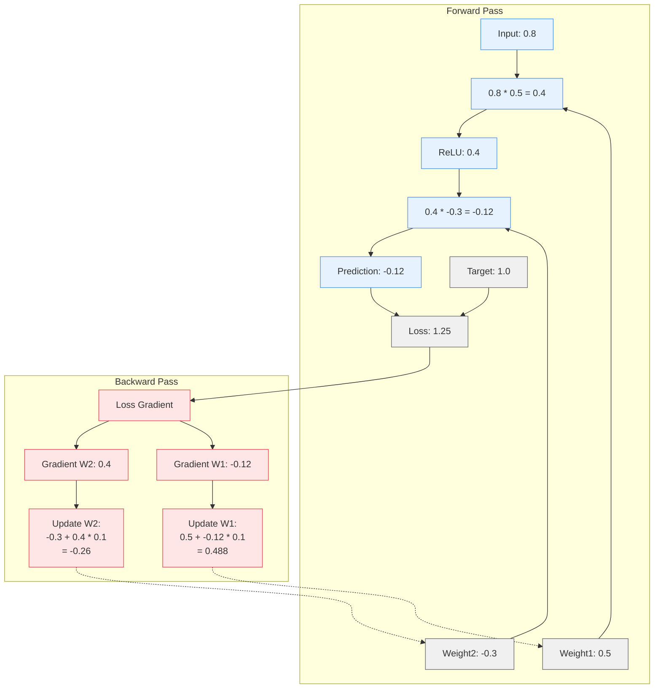

# Lecture 4: MNIST Dataset

## Questions and Answers

### 1. **How is a grayscale image represented on a computer? How about a color image?**
   > For grayscale, an image is represented using a 2D array. Each element (or pixel) is represented using a value from 0 (black) to 255 (white). A colour image is represented using a 3D array, with an added dimension for colour channels. The most common representation is RGB (red, green, blue).

### 2. **How are the files and folders in the `MNIST_SAMPLE` dataset structured? Why?**
```
MNIST_SAMPLE/
│
├── train/
│   ├── 3/
│   │   ├── 0.png
│   │   ├── 1.png
│   │   ├── 2.png
│   │   ├── ...
│   │   └── (thousands of images of digit 3)
│   │
│   └── 7/
│       ├── 0.png
│       ├── 1.png
│       ├── 2.png
│       ├── ...
│       └── (thousands of images of digit 7)
│
├── valid/
│   ├── 3/
│   │   ├── 0.png
│   │   ├── 1.png
│   │   ├── ...
│   │   └── (hundreds of validation images of digit 3)
│   │
│   └── 7/
│       ├── 0.png
│       ├── 1.png
│       ├── ...
│       └── (hundreds of validation images of digit 7)
│
└── labels.csv
```

### 3. **Explain how the "pixel similarity" approach to classifying digits works.**
   > The pixel similarity approach works by first creating an "ideal" version of each digit through averaging all training examples. For classification, we take a new image and compare it pixel-by-pixel to each ideal digit. At each position, we calculate the difference between pixel values. These differences are summed across all pixels to measure total distance. The ideal digit with the smallest total distance is chosen as the classification. This method treats each image as a point in high-dimensional space where each dimension represents one pixel position.

### 4. **What is a list comprehension? Create one now that selects odd numbers from a list and doubles them.**

> A list comprehension is a concise way to create a new list by applying an expression to each item in an existing list, often with a filter condition.
>
> It has the form:
> ```
> [expression for item in iterable if condition]
> ```
>
> Example that selects odd numbers and doubles them:
> ```
> [number * 2 for number in my_list if number % 2 != 0]
> ```

### 5. **What is a "rank-3 tensor"?**
> Tensor ranks describe the number of dimensions or axes:
>   - Rank-0 tensor: scalar (single number, no dimensions)
>   - Rank-1 tensor: vector (1D array, like a list of numbers)
>   - Rank-2 tensor: matrix (2D array, like a table with rows and columns)
>   - Rank-3 tensor: 3D array (like a stack of matrices or a cube of numbers)
> In the case of the MNIST dataset the batch of greyscale images are rank-3 tensors (batch_size, height, width)


### 6. **What is the difference between tensor rank and shape? How do you get the rank from the shape?**
> Rank refers to the number of dimensions or axes a tensor has, while shape describes the size of each dimension.
> Tensor rank: The number of dimensions (aka the "order" or "degree" of the tensor)
> - Scalar: rank 0
> - Vector: rank 1
> - Matrix: rank 2
> - 3D array: rank 3

> Tensor shape: A tuple specifying the length of each dimension
> - Vector of length 5: shape (5,)
> - 3×4 matrix: shape (3, 4)
> - Batch of 32 images of size 28×28: shape (32, 28, 28)

> Getting rank from shape: The rank is simply the length of the shape tuple. For example:
> - Shape (5,) → rank 1
> - Shape (3, 4) → rank 2
> - Shape (32, 28, 28) → rank 3

### 7. **What are RMSE and L1 norm?**
> RMSE (Root Mean Square Error):
> - Formula: √(mean(squared errors))
> - Process: Calculate the difference between predicted and actual values; square those differences; take the mean of those squared differences and; take the square root of that mean
> - In math notation: RMSE = √(1/n · Σ(yi - ŷi)²)

> L1 norm (Mean Absolute Error):
> - Formula: mean(|errors|)
> - Process: Calculate the difference between predicted and actual values; take the absolute value of those differences (make them positive) and; take the mean of those absolute differences
> - In math notation: L1 = 1/n · Σ|yi - ŷi|

### 8. **How can you apply a calculation on thousands of numbers at once, many thousands of times faster than a Python loop?**
> Using vectorised operations through NumPy arrays or PyTorch tensors, which leverage broadcasting and are implemented in low-level languages like C/C++.
> 
> Think of vectorized operations like this: Instead of cutting 1,000 apples one-by-one (Python loop), you place all apples on a special cutting board with 1,000 helpers who cut all apples simultaneously (vectorised operation).
> 
> When you write ```result = my_array * 2```, you're telling the computer to multiply ALL numbers by 2 at once, not one at a time.
> 
> This works because:
> - Broadcasting automatically handles different-shaped arrays
> - Low-level implementation runs optimized C/CUDA code behind the scenes
> - Parallel processing uses specialised hardware to perform many calculations simultaneously
>
> This approach is essential for deep learning, as it's what makes training neural networks feasible rather than taking years to complete.


### 9. **Create a 3×3 tensor or array containing the numbers from 1 to 9. Double it. Select the bottom-right four numbers.**
> A 3x3 tensor/array...
> ```
> [1, 2, 3]
> [4, 5, 6]
> [7, 8, 9]
> ```
> Double it...
> ```
> [2, 4, 6]
> [8, 10, 12]
> [14, 16, 18]
> ```
> The bottom-right four numbers would mean the 2x2 square (submatrix) in the corner
> ```
> [10, 12]
> [16, 18]
> ```

### 10. **What is broadcasting?**
> Broadcasting is a clever trick that lets you perform operations between arrays of different shapes without having to manually resize them.
>
> When we have 100 images of 28×28 pixels and one ideal digit image of 28×28 pixels, the shapes are:
> - Batch of images: (100, 28, 28)
> - Ideal digit: (28, 28)
>
> These aren't the same shape - the batch has an extra dimension for the 100 different images.
>
> Without broadcasting, you'd need to resize the ideal digit to shape (100, 28, 28) by making 100 copies of it. But broadcasting handles this automatically.
>
> When you write:
> ```pythonCopyresult = batch_images - ideal_digit```
> 
> Broadcasting virtually expands the (28, 28) ideal digit to (100, 28, 28) by repeating it 100 times, but without actually using extra memory. It's as if the computer is smart enough to say, "I see you want to subtract this single template from each of your 100 images, so I'll apply the same template to each one."

### 11. **Are metrics generally calculated using the training set, or the validation set? Why?**

> Metrics are calculated on the validation set because:
> - We want to measure how well our model generalizes to data it hasn't seen during training
> - Using the training set would give an overly optimistic view of model performance (since the model has already learned from that data)
> - The validation set serves as a proxy for how the model will perform on real-world data
>
> This is a fundamental principle in machine learning - we always evaluate model performance on data that wasn't used for training to get an honest assessment of how well it will work on new data.

### 12. **What is SGD?**
> SGD stands for Stochastic Gradient Descent. It's an optimisation algorithm that:
> - Takes the derivative (gradient) of the loss function with respect to model parameters
> - Updates those parameters in the opposite direction of the gradient to minimize the loss
> - Uses randomly selected subsets of data (mini-batches) instead of the entire dataset for each update, making it 'stochastic'
> 
> The 'stochastic' part is crucial - it means we use random samples rather than the whole dataset for each step. This makes training faster and introduces helpful randomness that can avoid getting stuck in local minima.
>
> The goal is to iteratively follow the gradient downhill until we reach a minimum where the derivative approaches zero, which represents the optimal model parameters that minimize the loss function.
>
> SGD optimises neural network digit recognition by iteratively adjusting weights based on prediction errors. For each batch of images, SGD:
> - Calculates how wrong our predictions are (loss)
> - Determines how each pixel weight should change to reduce errors (gradients)
> - Updates all weights slightly in their optimal directions
>
> This process gradually sculpts the weights to highlight important pixel patterns - giving more weight to distinctive features like the top line of a "7" or curves of a "3". Through thousands of small adjustments, SGD finds the optimal weight configuration that best distinguishes between digits.
>
> From a 28x28 pixel image, it's learning a complex decision boundary in 784-dimensional space that separates different digits. What makes SGD powerful is its ability to simultaneously adjust all 784 weights to minimize errors across thousands of training examples, finding patterns our brains cannot consciously perceive in such high-dimensional data.

### 13. **Why does SGD use mini-batches?**
> Uses randomly selected subsets of data (mini-batches) instead of the entire dataset for each update, making it 'stochastic'. Three key reasons are efficiency, stability, and generalisation.

### 14. **What are the seven steps in SGD for machine learning?**

> The seven steps in SGD for machine learning are:
>
> 1. Initialize the weights (usually randomly)
> 2. Predict (forward pass) - use current weights to make predictions
> 3. Calculate loss - measure how wrong the predictions are
> 4. Calculate gradients - compute how changing each weight would affect the loss
> 5. Step (update) the weights based on the gradients and learning rate
> 6. Repeat steps 2-5 for multiple batches/epochs
> 7. Stop when the model is good enough or you run out of time/patience
>
> These steps form the fundamental training loop for virtually all deep learning models, from simple linear classifiers to complex neural networks.

### 15. **How do we initialize the weights in a model?**
> We randomise a weight for each parameter around the value of zero (either positive or negative). A conststant (or bias) is also added but are randomised in a different way (sometimes zero, or small constants etc...)

### 16. **What is "loss"?**
> A loss function is a measure of how wrong the model's predictions are compared to the correct answers. It quantifies the difference between predicted values and target values across a dataset, producing a single number that represents the overall error. The goal of training is to minimise this loss value by adjusting the model's parameters. Different types of problems use different loss functions (like mean squared error or cross-entropy loss).

### 17. **Why can't we always use a high learning rate?**
> A high learning rate causes the model to take steps that are too large during optimisation.
>
> This creates several problems:
> 1. Overshooting - The model jumps past the minimum and lands on the opposite side of the valley
> 2. Oscillation - Parameters bounce back and forth across the optimal point without converging
> 3. Divergence - In extreme cases, the loss actually increases with each step, moving further from the solution
>
> As illustrated in the chapter's diagrams, when the learning rate is too high, each step can jump to a worse position on the loss curve. Instead of smoothly descending toward the minimum, the training process becomes unstable and may never converge. The ideal learning rate allows the model to make steady progress downhill without these dramatic, counterproductive jumps.

### 18. **What is a "gradient"?**
> A gradient is the vector of partial derivatives of the loss function with respect to each model parameter. It represents:
> 1. The direction of steepest increase in the loss function at the current parameter values
> 2. How much each individual parameter affects the loss when changed slightly
> 3. The slope of the loss surface in multiple dimensions simultaneously
>
> In deep learning, we calculate the gradient for every weight and bias. For each parameter, the gradient tells us two crucial things:
> - Which direction to adjust the parameter (increase or decrease it)
> - How sensitive the loss is to changes in that parameter

> During SGD, we move parameters in the opposite direction of the gradient (the negative gradient) to decrease the loss most efficiently. For a neural network with millions of parameters, the gradient effectively gives us a "map" showing how to adjust each one to improve our predictions.

### 19. **Do you need to know how to calculate gradients yourself?**
> Nope, but it does help! There are numerous Python packages that can calculate gradients for us. For example, with PyTorch:
> ```
> # 1. Create a tensor and tell PyTorch to track gradients for it
> x = torch.tensor([2.0, 3.0, 4.0], requires_grad=True)
> 
> # 2. Perform calculations using this tensor
> y = x**2 + 2*x + 1  # some function
> 
> # 3. Calculate the sum or mean to get a scalar output
> loss = y.mean()
> 
> # 4. Calculate gradients with respect to x
> loss.backward()
> 
> # 5. Access the gradients
> print(x.grad)  # Shows how loss changes when x changes
> ```
> PyTorch handles all the complex calculus behind the scenes, computing derivatives through any sequence of operations. This makes implementing neural networks much more practical, the data scientist can focus on designing the model rather than working out all the derivatives by hand.

### 20. **Why can't we use accuracy as a loss function?**
> Imagine you're training a model to tell apart 3s and 7s. For each image, your model outputs a score between 0 and 1. If it's above 0.5, you call it a "3"; otherwise, it's a "7".
>
> The problem with accuracy is that it only cares about whether you're on the right side of 0.5:
> - If your model says 0.51 for a real "3", that's correct (score: 1)
> - If your model says 0.99 for a real "3", that's also correct (score: 1)
> - If your model says 0.49 for a real "3", that's wrong (score: 0)
>
> So here's why it breaks:
>
> Tiny changes don't matter: If you slightly improve your model's prediction from 0.51 to 0.52 for a "3", the accuracy doesn't change at all.
>
> No direction to improve: The gradient tells your model "which way to adjust weights to improve." But with accuracy, the gradient is usually zero because small weight changes rarely flip a prediction across the 0.5 boundary.

### 21. **Draw the sigmoid function. What is special about its shape?**
> The sigmoid function has an S-shaped curve that rises from 0 to 1. What's special about its shape is that it:
> - Squashes any input value into the range [0,1]
> - Is smooth and differentiable everywhere
> - Has a gentle slope that approaches zero at both extremes
> - Creates a natural threshold at 0.5
> - Transforms linear inputs into probability-like outputs

### 22. **What is the difference between a loss function and a metric?**
   - A loss function reveals what the model is predicting as compared to the target, its the difference. Further, loss functions are designed to be differentiable to drive the training process. A metric is how the model performs after training using the validation data set, metrics measure what we actually care about (like accuracy) for human understanding.

### 23. **What is the function to calculate new weights using a learning rate?**
> The function to calculate new weights using a learning rate is:
> ```
> new_weights = old_weights - learning_rate * gradient
> ```
> Or written mathematically:
> w₍ₙₑₓₜ₎ = w - lr * ∇w
> 
> This formula:
> 1. Takes the current weights
> 2. Subtracts the product of the learning rate and the gradient
> 3. The negative sign ensures we move in the direction that reduces the loss
> 4. Smaller learning rates result in smaller steps
>
>This weight update equation is the fundamental operation in gradient descent that allows the model to learn from its errors by incrementally adjusting parameters in the direction that reduces the loss function.

### 24. **What does the `DataLoader` class do?**
> The DataLoader class handles the process of:
> 1. Fetching data in mini-batches from a dataset
> 2. Shuffling the data for each epoch (if requested)
> 3. Using multiple workers to load data in parallel (for efficiency)
> 4. Collating individual samples into batches
>
> It converts a dataset (like a collection of images and labels) into an iterable that yields batches of data in the format needed for training. This makes training more efficient by preparing data in the background while the model is computing, and by grouping examples into appropriately sized batches that can be processed together.

### 25. **Write pseudocode showing the basic steps taken in each epoch for SGD.**
> ```
> for epoch in range(num_epochs):
>   # Optional: shuffle the dataset
>    shuffle(data)
>    
>   # Loop through mini-batches
>   for batch in create_mini_batches(data, batch_size):
>       # Get inputs and targets for this batch
>       inputs, targets = batch
>        
>       # 1. Forward pass: compute predictions
>       predictions = model(inputs)
>       
>       # 2. Calculate loss
>       loss = loss_function(predictions, targets)
>       
>       # 3. Compute gradients (backward pass)
>       loss.backward()
>        
>       # 4. Update weights using gradients
>       for param in model.parameters():
>           param.data -= learning_rate * param.grad
>            
>       # 5. Zero gradients for next iteration
>       zero_gradients(model)
>  
>   # Optional: calculate metrics on validation set
>   validation_metrics = evaluate_model(model, validation_data)
>   print(f"Epoch {epoch}: {validation_metrics}")
> ```

### 26. **Create a function that, if passed two arguments `[1,2,3,4]` and `'abcd'`, returns `[(1, 'a'), (2, 'b'), (3, 'c'), (4, 'd')]`. What is special about that output data structure?**
> Here's a function that creates the requested output:
> ```
> def create_pairs(numbers, letters):
>    return list(zip(numbers, letters)) 
> ```
> Example usage:
> ```
> result = create_pairs([1,2,3,4], 'abcd')
> print(result)  # [(1, 'a'), (2, 'b'), (3, 'c'), (4, 'd')]
> ```
> What's special about this output data structure is that it creates a list of tuples where each tuple pairs corresponding elements from the two input sequences. This is exactly what the zip function does - it "zips" together multiple iterables element by element.
>
> The resulting structure is useful because:
> 1. It maintains the relationship between corresponding elements
> 2. It's structured as a list of tuples, which is a common format for datasets where each tuple contains features and target values
> 3. This matches the structure expected by PyTorch's Dataset class, where each item needs to return an (input, target) pair
>
> For deep learning, similar data structures are used to create datasets where each item contains both an input image and its corresponding label.

### 27. **What are the "bias" parameters in a neural network? Why do we need them?**
> The bias terms are additional learnable parameters (the 'b' in w*x + b) that allow the model to shift the output up or down regardless of the input. We need them because:
> 1. Without bias, every output would be forced to go through zero when the input is zero
> 2. Bias gives the network flexibility to shift activation functions where needed
> 3. It's like giving each neuron a "default value" or baseline that it can adjust during training
>
> Think of it like this: weights determine the slope of the relationship between input and output, while bias determines the baseline or starting point. Without bias, you'd be forcing every relationship to pivot through the origin (0,0), which is too restrictive for most real-world relationships.
>
> The chapter shows this when demonstrating that w*x alone isn't flexible enough - adding bias b allows the model to better fit the data.

### 28. **What does the `@` operator do in Python?**
> In this context, the @ operator performs matrix multiplication. For example:
> ```
> # If a is a (2,3) matrix and b is a (3,2) matrix
> result = a @ b  # Matrix multiplication
> ```
> This is different from the * operator which performs element-wise multiplication.
>
> Your answer refers to decorator syntax (like @property or @classmethod), which is a different use of the @ symbol in Python. While decorators are indeed marked with @, in the context of neural networks and the chapter's discussion, @ is specifically used for matrix multiplication operations between tensors or arrays.
>
> Matrix multiplication is a fundamental operation in neural networks, used to multiply input values by weight matrices to compute layer activations.

### 29. **What does the `backward` method do?**
> The `backward()` method performs backpropagation, which calculates the gradients (derivatives) of the loss with respect to each parameter in the model. It works backwards through the layers, calculating how much each parameter contributed to the final loss. These gradients are then stored and used by the optimizer to update the model's parameters during training. The backward pass complements the forward pass (where predictions are calculated) in the training process.
>
> For example:

> This updated diagram shows:
>
> Forward Pass (Blue):
> - Input value (0.8) flows through network
> - First weight multiplication (0.8 * 0.5 = 0.4)
> - ReLU activation (keeps 0.4 as it's positive)
> - Second weight multiplication (0.4 * -0.3 = -0.12)
> - Final prediction (-0.12)
> - Compare with target (1.0)
> - Calculate loss
>
> Backward Pass (Red):
> - Start from the loss
> - Calculate gradients for each weight
> - For W2: Shows how much its change affected the final error
> - For W1: Shows how much its change affected the final error
> - Calculate new weights using learning rate (0.1)
> - Update weights with new values
>
> The dotted lines show how the calculated updates flow back to modify the original weights. This process repeats for each batch of training data, gradually improving the weights to reduce the overall loss.

### 30. **Why do we have to zero the gradients?**
   - Answer

### 31. **What information do we have to pass to `Learner`?**
   - Answer

### 32. **Show Python or pseudocode for the basic steps of a training loop.**
   - Answer

### 33. **What is "ReLU"? Draw a plot of it for values from `-2` to `+2`.**
   - Answer

### 34. **What is an "activation function"?**
   - Answer

### 35. **What's the difference between `F.relu` and `nn.ReLU`?**
   - Answer

### 36. **The universal approximation theorem shows that any function can be approximated as closely as needed using just one nonlinearity. So why do we normally use more?**
   - Answer


## Further Research:

### 1. **Create your own implementation of `Learner` from scratch, based on the training loop shown in this chapter.**
> answer

### 2. **Complete all the steps in this chapter using the full MNIST datasets (that is, for all digits, not just 3s and 7s). This is a significant project and will take you quite a bit of time to complete! You'll need to do some of your own research to figure out how to overcome some obstacles you'll meet on the way.**
> answer


